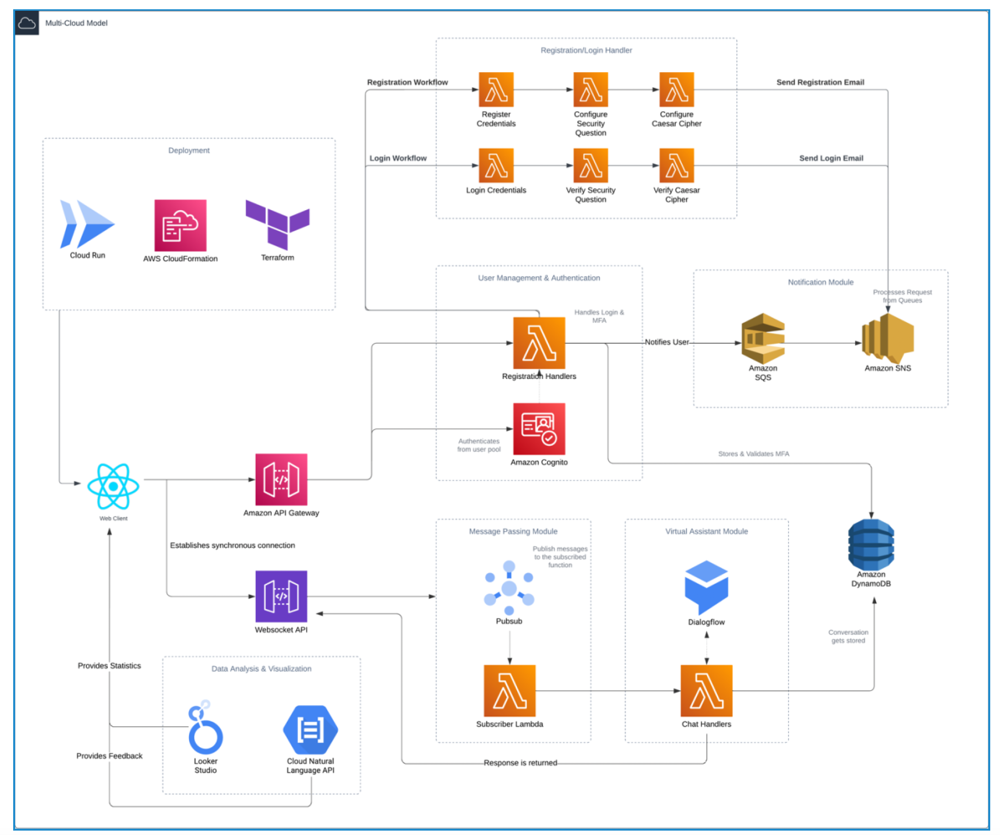

## Serverless Vacation Rental Application

This project is a serverless web application designed to streamline the booking and management of vacation homes. It uses a **Next.js frontend** and a **serverless backend architecture** deployed via AWS Lambda functions. The application integrates AWS and GCP services, providing real-time user interactions, secure authentication, and data visualization dashboards.

Project Report Document: [Report](https://drive.google.com/file/d/1LBIb-EVT60xSyin-yt54jfojh0Gbm2rr/view?usp=sharing)

## Features
- **User Management**: Registration, login, and multi-factor authentication (MFA) using AWS Cognito.
- **Virtual Assistant**: A Dialogflow-powered chatbot assists users with booking and general queries.
- **Real-Time Messaging**: Asynchronous message passing between customers and agents.
- **Notifications**: Email notifications for successful registrations, bookings, and logins using AWS SNS.
- **Data Analysis**: Data migration and visualization using Cloud SQL and Looker Studio.

---
## System Architecture


---
## Project Structure
- frontend/ - Contains the Next.js application.
- backend/ - Contains AWS Lambda functions, including authorization and API handling.
- IaC/ - Terraform and cloudFormation code for cloud infrastructure.

---
## Project Modules

### Module 1: User Management
This module handles user registration, login, and multi-factor authentication (MFA) using AWS Cognito.

- **Components**:
  - **Registration**: Allows users to create an account. User details are validated, and an email verification code is sent.
  - **Login**: Verifies user credentials with AWS Cognito and DynamoDB, creating a session if successful.
  - **Multi-Factor Authentication (MFA)**: Utilizes security questions and a Caesar cipher as additional authentication steps.

- **Features**:
  - **Email Verification**: Ensures only verified users can access the system.
  - **MFA with Custom Security Questions**: Enhances account security.
  - **Session Management**: Tracks user sessions and MFA status in DynamoDB for secure access.

### Module 2: Virtual Assistant
This module provides chatbot functionality, allowing users to interact with a virtual assistant for various tasks.

- **Components**:
  - **Dialogflow CX**: Manages intents and responses based on user inputs.
  - **AWS Lambda**: Handles webhook requests and fetches booking details.
  - **Google Cloud Services Integration**: For cross-cloud communication and data retrieval.

- **Features**:
  - **Intent Recognition**: Detects user intent to provide appropriate guidance.
  - **Booking Assistance**: Retrieves booking information based on reference codes.
  - **Dynamic Query Handling**: Routes user requests to relevant modules based on intent.

### Module 3: Message Passing Module
This module enables asynchronous, real-time communication between users and agents.

- **Components**:
  - **GCP Pub/Sub**: Publishes and subscribes to messages for real-time updates.
  - **Firebase Firestore**: Stores and retrieves messages asynchronously.
  - **Frontend Integration**: Allows users and agents to chat in real-time within the application.

- **Features**:
  - **Ticket Creation**: Enables users to generate support tickets.
  - **Asynchronous Messaging**: Allows users and agents to communicate without a live connection.
  - **Real-Time Updates**: Fetches and displays messages immediately on the frontend.

### Module 4: Notifications
This module manages email notifications for critical system events.

- **Components**:
  - **AWS SNS**: Sends email notifications for user registration, login, and booking updates.
  - **SQS Integration**: Queues messages for reliable, managed email delivery.
  - **Filter Policies**: Configures notification filters to ensure users receive only relevant updates.

- **Features**:
  - **Automated Emails**: Notifies users of successful registrations, logins, and bookings.
  - **Targeted Notifications**: Only relevant users are notified, improving user experience.
  - **Reliable Delivery**: Uses SNS and SQS for robust and timely notification delivery.

### Module 5: Data Analysis & Visualization
This module provides data migration and visualization for login statistics and feedback sentiment.

- **Components**:
  - **Cloud SQL**: Converts DynamoDB data into SQL format for Looker Studio.
  - **Looker Studio Integration**: Visualizes data on dashboards for analytics.
  - **Google Natural Language API**: Analyzes sentiment in user feedback.

- **Features**:
  - **Login Statistics Dashboard**: Provides visual insights into login patterns.
  - **Feedback Sentiment Analysis**: Scores feedback to help improve service quality.
  - **Data Migration & ETL**: Uses Cloud SQL for efficient data conversion and visualization.

### Module 6: Web Application & Deployment
This module covers frontend and backend integration, deployment, and infrastructure management.

- **Components**:
  - **Next.js Frontend**: User interface for web interactions, integrated with backend services.
  - **AWS Lambda Functions**: Serverless backend functions for API handling and data processing.
  - **Terraform & CloudFormation**: Infrastructure as Code (IaC) tools for resource management.

- **Features**:
  - **Frontend and Backend Integration**: Ensures seamless data flow between frontend and backend.
  - **Infrastructure as Code (IaC)**: Automates deployment and resource management.

---

Each module is designed to work independently but contributes to the overall functionality of the serverless application, providing users with secure, real-time access to various features.

## Installation

### Prerequisites
- Node.js (v14+)
- NextJs
- AWS CLI
- Google Cloud CLI
- Access to AWS and GCP accounts


### Setup Instructions

1. **Clone the Repository**
    ```bash
    git clone https://github.com/your-username/your-repo-name.git
    cd your-repo-name
    ```

2. **Frontend (Next.js)**

    Navigate to the `frontend` directory and install dependencies:
    ```bash
    cd frontend
    npm install
    ```

    Set up your `.env.local` file in the `frontend` directory with the following environment variables:
    ```env
    NEXT_PUBLIC_BACKEND_URL={API gateway}
    NEXT_PUBLIC_GCP_PROJECT_ID=s
    NEXT_PUBLIC_GOOGLE_SERVICE_EMAIL=
    NEXT_PUBLIC_GOOGLE_SERVICE_PRIVATE_KEY=
    NEXT_PUBLIC_GOOGLE_DIALOGFLOW_REGION=
    NEXT_PUBLIC_GOOGLE_DIALOGFLOW_AGENT_ID=
    NEXT_PUBLIC_FIREBASE_API_KEY=
    NEXT_PUBLIC_FIREBASE_AUTH_DOMAIN=
    NEXT_PUBLIC_FIREBASE_PROJECT_ID=
    NEXT_PUBLIC_FIREBASE_STORAGE_BUCKET=
    NEXT_PUBLIC_FIREBASE_MESSAGING_SENDERID=
    NEXT_PUBLIC_FIREBASE_APP_ID=
    NEXT_PUBLIC_FIREBASE_MEASUREMENT_ID=
    JWT_SECRET_KEY=
    ```

    Start the development server:
    ```bash
    npm run dev
    ```

3. **Backend (Serverless Functions with AWS Lambda)**

    Ensure your AWS CLI is configured. Use Infrastructure-as-Code (IaC) tools like **Terraform** or **CloudFormation** to set up the AWS infrastructure. Example setup includes:
    - API Gateway for routing
    - Lambda functions for backend processing
    - SNS for email notifications

    Deploy the Lambda functions:
    ```bash
    aws lambda create-function --function-name your-lambda-function-name --runtime nodejs14.x --handler index.handler --zip-file fileb://function.zip --role your-iam-role
    ```

    **Note**: Include the IAM roles and permissions required for Lambda to access AWS services.

---

## Usage

1. **Frontend**: Access the application at `http://localhost:3000` during development.
2. **Backend**: API endpoints are accessible via the API Gateway URL defined in `NEXT_PUBLIC_BACKEND_URL`.

---
## Contributors
- Hatim Patrawala
- Heramb Kulkarni
- Yukta Gurnani
- Nisarg Khacharia